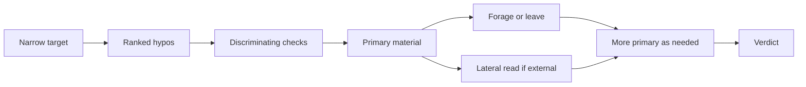

# Investigation framework

One loop for code, docs, data, and research claims. Phases can weave — repo read → external claim check → back to code (or reverse). Do not announce a "track" to the user. Apply the same loop to the primary material in play.

Uses the **investigate** verdict: a plain-language settlement of what holds, what does not, and what stays open (no fixed label). **Find and verdict only** through the evidence pass — not the fix. After the verdict, hand off or exit find-only as below.

## Loop

1. **Narrow** until primary material is purposeful (clarification chain in main skill).
2. **Hypothesize** — 2–4 ranked, falsifiable hypos. Prefer mechanism/model over situation guesses.
3. **Discriminating checks** — cheapest kill test per hypo, ranked by information per cost. Run top kill tests before confirmatory reads.
4. **Primary material** — read the actual code, document, dataset, or cited source.
5. **Forage or leave** — follow scent. After 2–3 reads with no signal, **leave** the patch and re-rank (can switch material class).
6. **Re-enter** when new leads appear (weave allowed).
7. **Verdict** — citable locus + plain-language settlement (what holds / does not / stays open).

## Domain moves (same loop)

| Move               | When                                          | How                                                                                                                                            |
| ------------------ | --------------------------------------------- | ---------------------------------------------------------------------------------------------------------------------------------------------- |
| **Repo forage**    | Hunch points at code, config, or in-repo docs | Follow scent: callers, callees, tests, error sites, related types. Prefer dependency slices over whole-file reads when the hunch is localized. |
| **Locate-to-cite** | Behavioral code hunch                         | Narrow to `file:line` (or config key, failing path) sufficient for the verdict — then **stop**. Do not bisect-as-repair or implement the fix.  |
| **Lateral read**   | Claim depends on web/docs/vendor material     | Leave the page quickly. Note who else says this. Note source class (primary vs secondary, official vs commentary).                             |
| **Source class**   | Before settling a non-repo claim              | State what kind of source supports the claim. Conflicting independents → name the split in the verdict or parallel-perspective.                |

## When to escalate (multi)

| Situation                                    | Recipe                                                                                    |
| -------------------------------------------- | ----------------------------------------------------------------------------------------- |
| User asks to fish broadly                    | [parallel-broad.md](parallel-broad.md)                                                    |
| Multiple independent topics, no single hunch | [parallel-research.md](parallel-research.md) — then back here if a specific claim remains |
| Genuinely mixed or contested evidence        | [parallel-perspective.md](parallel-perspective.md)                                        |

## Handoffs (after verdict)

| Next need                                       | Where                                                                                                              |
| ----------------------------------------------- | ------------------------------------------------------------------------------------------------------------------ |
| Implement the fix, repro, make tests pass       | Hub **diagnose** / **tdd** when installed. Else consumer **testing** / **debug** or project `AGENTS.md`.           |
| User explicitly asks to fix / repro / implement | **Exit find-only** — stop applying investigate no-fix constraints. Follow the request or the named consumer skill. |
| Still fuzzy on intent                           | Return to focused intent clarification                                                                             |
| Written plan to critique                        | **second-opinion**                                                                                                 |
| Pressure-test design before build               | **grill**                                                                                                          |

## Anti-patterns

- Tool rankings or "likely file" lists as evidence — read primary material.
- Single-cause theater when multiple mechanisms fit the evidence.
- Implementing the fix during the evidence pass (before verdict / without an explicit post-verdict fix request).
- Hard-requiring **diagnose** / **tdd** / **testing** / **debug** when absent — fall back to consumer routing or `AGENTS.md`.
- Heavy hypothesis matrices or formal ACH tables in user-facing output — keep competing hypos + discriminating checks only.
