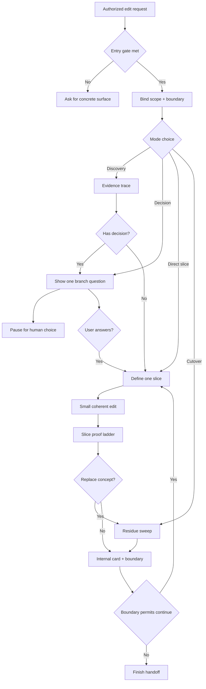
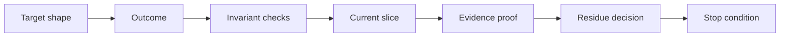

# Refactor companion

<!-- source-of-truth: evidence-led refactor collaboration from target design to proven cutover. -->
<!-- doc-meta: owner=eng | last-reviewed=2026-09-03 -->



Preserve the developer's target design while changing existing code in small, coherent, proven slices. Read facts first. Ask only for material human decisions. Remove obsolete design residue and protect unrelated work.

Internal record → [refactor-card.md](references/refactor-card.md). Mode selection → [interaction-modes.md](references/interaction-modes.md). Slice proof → [slice-proof.md](references/slice-proof.md). Cutover rules → [residue-and-cutover.md](references/residue-and-cutover.md). User-facing reports → [output-format.md](references/output-format.md).

Extended design vocabulary is available in [codebase-design.md](https://raw.githubusercontent.com/csark0812/toolbox/main/references/codebase-design.md). The core workflow remains complete without companion skills.

Composition boundaries → [process-skill-composition.md](https://raw.githubusercontent.com/csark0812/toolbox/main/references/process-skill-composition.md).

## Entry gate

- The user authorizes edits to an existing code surface.
- The task replaces, simplifies, migrates, cuts over, reassigns ownership, or removes an old design shape.
- A repository, branch, worktree, commit, pull request, or named path is in scope.
- If the request is analysis-only, stay read-only and explain that implementation is not active.
- If no concrete surface exists, ask for one. Do not invent code from a scenario description.

## Core contract

1. Treat the developer's stated target, required shape, and prohibited shape as design authority.
2. Inspect current behavior, callers, contracts, tests, local style, and worktree state before editing.
3. Ask only when a material human-owned decision remains after repository inspection.
4. Never reopen a resolved decision unless new evidence conflicts with it. Show that evidence first.
5. Define one coherent slice and its proof before editing.
6. Implement, prove, and inspect the slice for residue from the old design.
7. Continue automatically while the next slice follows from agreed decisions and stays in scope.
8. Stop at contract, authority, scope, or evidence boundaries.
9. Preserve unrelated work. Git state changes need explicit user authority.
10. Use pragmatic Simple English for previews, questions, progress, and reports.
11. Use short Mermaid charts for transitions between modes, slice lifecycle, and residue decision points.
12. Link every repository-backed claim in user-facing output to the exact file and line that supports it. Use a clickable Markdown file link with a repo-relative label and an absolute workspace target; the target is the absolute workspace path followed by `:line` (for example, label `src/owner.ts:42`, target `/absolute/workspace/app/src/owner.ts:42`). Never leave a source path or `file:line` citation as bare text when a link can be made.

## Refactor card

Keep this record internal and current:

```text
Outcome:
Invariants:
Required shape:
Prohibited shape:
Style evidence:
Resolved decisions:
Open decision:
Current slice:
Proof:
Stop if:
```

Do not dump the card into routine user updates. Details → [refactor-card.md](references/refactor-card.md).



## Choose the current mode

| Mode                        | Use when                                                                 |
| --------------------------- | ------------------------------------------------------------------------ |
| **Discovery before change** | Behavior, consumers, or invariants are unclear                           |
| **Decision checkpoint**     | Two credible choices change behavior, ownership, compatibility, or scope |
| **Direct slice**            | Target, contract, and scope are clear                                    |
| **Cutover sweep**           | A path, concept, or abstraction was replaced                             |

Use one mode for the current turn. A refactor can move between modes. Read [interaction-modes.md](references/interaction-modes.md).

Several unresolved architecture branches need dedicated design dialogue before implementation. One local blocking decision stays inside this workflow.

## Slice loop

1. Bind the worktree, scope, and protected unrelated changes.
2. Fill the card from the request and repository evidence.
3. Select the current mode.
4. For a direct slice, state its outcome, change, scope, proof, and stop condition in compact form, with clickable links to the exact files and lines behind each material claim.
5. Make the smallest coherent edit that expresses the target design.
6. Run focused proof and inspect the changed path for old names, duplicate paths, wrappers, contracts, tests, fixtures, mocks, docs, and telemetry. Link the reported evidence to the exact files and lines inspected.
7. Remove confirmed in-scope residue or retain it for a named live reason.
8. Update the internal card. Continue or report the exact boundary.

## Questions

Before asking, search callers, read the controlling contract, inspect nearby accepted code, and remove choices that evidence settles.

When a human decision remains:

- show the controlling evidence;
- ask one decision branch with one to three lettered options;
- mark one recommendation when evidence supports it;
- pause without editing the disputed shape.

Do not ask for repository facts or routine edit permission inside an agreed slice.

## Boundaries

- Stop when the requested shape conflicts with a live caller, public contract, user decision, authority boundary, or coherent scope.
- Separate source failures from missing dependencies, unavailable services, permissions, and other environment limits.
- A green test does not prove that the target architecture exists. Use caller, contract, search, diff, and runtime evidence as relevant.
- Do not turn uncertainty into speculative cleanup.
- Do not commit, push, merge, reset, rebase, or clean unless the user explicitly authorizes that action.
- Formal findings and merge decisions remain separate review work.

## Finish

Use [output-format.md](references/output-format.md). Offer an installed walkthrough or formal review as a next action. Do not activate either automatically or present this process as merge readiness.

## Consumer bindings

Project instructions supply local contracts, validation commands, and accepted style evidence. Do not edit installed copies in place.
