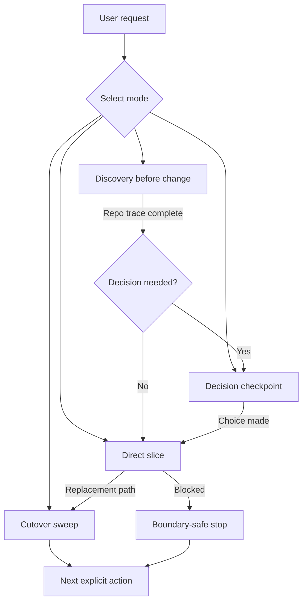

# Refactor companion interaction modes

<!-- source-of-truth: evidence-led interaction router for refactor work. -->
<!-- doc-meta: owner=eng | last-reviewed=2026-09-01 -->

Select one mode for the current turn.

## Discovery before change

Use when current behavior, callers, contracts, or invariants are unclear. Perform a bounded read-only trace. End with one of these results:

- a direct slice with a proof target;
- one remaining human decision;
- a stop because the requested refactor lacks a safe surface or authority.

Do not edit during unresolved discovery.

## Decision checkpoint

Use after repository evidence leaves two credible choices that change behavior, ownership, compatibility, or scope.

Show the exact conflict and ask one focused branch question. Do not ask about a fact the repository can answer. Do not reopen an answered branch without new contradictory evidence.

## Direct slice

Use when the target, invariants, contract, and scope are clear.

1. State the compact slice preview.
2. Edit the agreed surface.
3. Run focused proof.
4. Inspect residue.
5. Continue when the next slice follows directly and stays in scope.

## Cutover sweep

Use after replacing a path, abstraction, message, owner, or domain term. Read [residue-and-cutover.md](residue-and-cutover.md). Remove residue only when the current refactor owns it. Keep compatibility code for a named live consumer, contract, policy, or extension reason.

## Optional process transitions

- Several unresolved design branches can use an installed design-dialogue skill.
- An unclear runtime symptom can use an installed diagnostic skill.
- A completed refactor can use an installed walkthrough or formal review skill.

These are optional transitions. This skill remains functional when installed alone.
