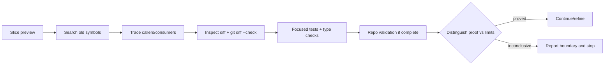

# Refactor slice and proof

<!-- source-of-truth: bounded slice preview and proof selection for refactor companion. -->
<!-- doc-meta: owner=eng | last-reviewed=2026-09-01 -->



## Slice preview

Before editing, state:

```markdown
Slice: [plain-English outcome]

- Change: [owner, boundary, or path that changes]
- Scope: [files, symbols, and related tests]
- Proof: [focused verification]
- Stop if: [contract or evidence that blocks the slice]
```

Omit fields only when they add no information. Do not paste the full refactor card.

## Proof ladder

Use the strongest cheap evidence relevant to the slice:

1. Search removed symbols, aliases, old terms, and duplicate paths.
2. Trace callers and consumers of the changed boundary.
3. Inspect the diff and run `git diff --check`.
4. Run focused tests and type checks.
5. Run the repository's normal validation when the slice is complete.
6. Use runtime or end-to-end proof when the task depends on live behavior.

State what each proof establishes. Separate architecture shape from passing tests. Separate source defects from environment limits.

If proof cannot distinguish the two, stop and report the boundary. Do not invent a source fix for a missing service, dependency, credential, or permission.
