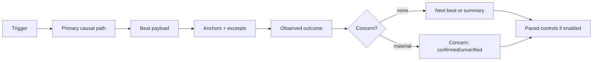
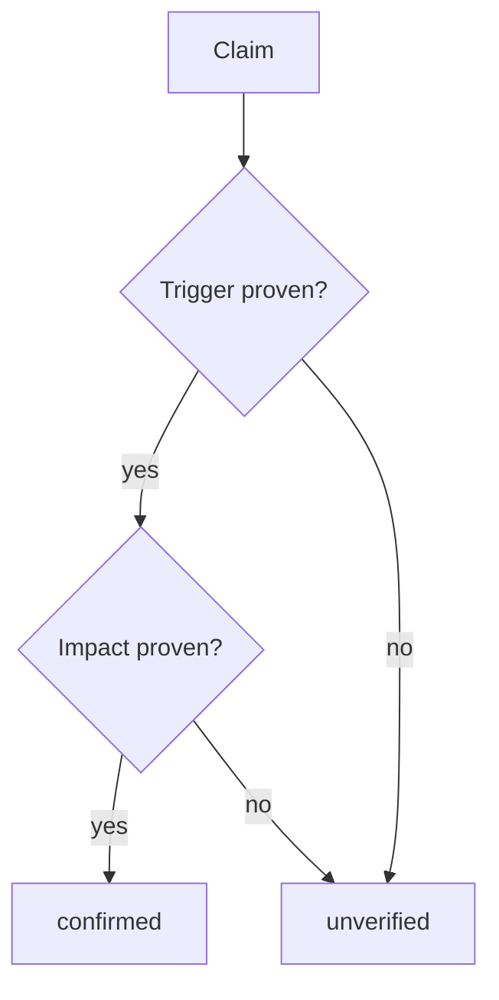

# Review walkthrough story format

<!-- source-of-truth: proportional evidence and output shapes for review walkthrough. -->
<!-- doc-meta: owner=eng | last-reviewed=2026-09-03 -->

Use prose as the default. Evidence supports the story; it does not define the layout.



## One paced beat

```markdown
## Step 2 — The live canvas takes ownership

[Short causal explanation with clickable links to the useful file and line anchors.]

[Optional compact excerpt when it clarifies the behavior.]

Summary: [one plain-English consequence]

Paused at Step 2. Say `next`, or ask about this step.
```

Use one or more decisive anchors. Do not set an arbitrary anchor quota. Every source-backed claim and copied excerpt needs a clickable Markdown link to the exact file and line. Use a repo-relative label and an absolute workspace target; the target is the absolute workspace path followed by `:line` (for example, label `src/router.ts:42`, target `/absolute/workspace/app/src/router.ts:42`). Copy excerpts from the bound source and keep them short. Do not reconstruct code. If an exact line cannot be resolved, say that the claim is unlinked and keep it `unverified`.

## Evidence and concerns



- Include `Proof` only when a test, reproduction, runtime result, or contract supports a consequential claim.
- Link proof to the exact test, reproduction, runtime artifact, or contract file and line when one exists.
- Omit an empty concern line.
- Use `confirmed` only when evidence proves both trigger and impact.
- Use `unverified` when either trigger or impact remains inferred.
- Keep concerns explanatory. Formal findings and merge decisions belong to a separate review.

## Finish

When the story ends or the user says `stop`, state:

- the start-to-result behavior that was covered;
- skipped beats;
- the main evidence;
- open questions, missing proof, and material concerns.

End with an understanding summary, not a claim about the user's mental state or merge readiness.
